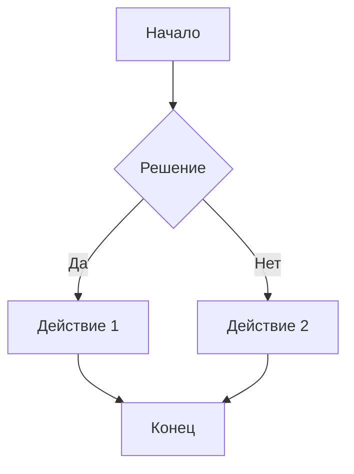

# **Приложения**

## **A. Шаблоны файлов для основных типов контента**

### **A.1. Шаблон новости (`news/YYYY-MM-DD.md`)**
```markdown
---
date: 'ГГГГ-ММ-ДД'
title: 'Заголовок новости'
preview: 'Краткий анонс новости для списка'
---

# Заголовок новости

Основное содержание новости...

## Подзаголовок

Дополнительная информация...


- Список
- Второй пункт

> Важное замечание или цитата

**Жирный текст** и *курсив*.
```

### **A.2. Шаблон публикации (статьи) (`publications/название-статьи.md`)**
```markdown
---
date: 'ГГГГ-ММ-ДД'
title: 'Заголовок публикации'
titlePhoto: '/images/publications/папка-статьи/cover.jpg'
authors: 'Фамилия И.О., Фамилия И.О.'
---

**Аннотация**. Краткое описание публикации.

**Ключевые слова**: ключевое слово 1, ключевое слово 2, ключевое слово 3.

# Введение

Текст публикации...

## Методы

Текст...

### Подраздел методов

- Метод 1
- Метод 2

## Результаты

| Параметр | Значение | Единица измерения |
|----------|----------|-------------------|
| Параметр 1 | 100 | % |
| Параметр 2 | 25.5 | мм |


## Заключение

Выводы исследования...

## Литература

1. Автор А.А. Название статьи // Журнал. 2020. № 1. С. 10-15.
2. Автор Б.Б. Название книги. М.: Издательство, 2019. 200 с.
```

### **A.3. Шаблон данных врача (`data/doctors/номер.фамилия.json`)**
```json
{
  "name": "Фамилия Имя Отчество",
  "positionFirst": "Должность (отображается в карточке врача)",
  "positionSecond": "Расширенная должность (для главной страницы)",
  "avatar": "/images/doctors/фамилия.png",
  "descriptionTitle": "Краткое описание для карточки",
  "description": "Полное описание врача.\nИспользуйте \\n для переноса строк.\nКаждое достижение с новой строки."
}
```

### **A.4. Шаблон вопроса-ответа (`data/faq/номер.question.json`)**
```json
{
  "date": "ДД.ММ.ГГГГ",
  "name": "Имя пациента",
  "question": "Текст вопроса?",
  "answer": "Развернутый ответ на вопрос.",
  "doctorName": "Фамилия врача (должен совпадать с фамилией одного из врачей в списке)"
}
```

### **A.5. Шаблон отзыва (`reviews/YYYY-MM-DD.md`)**
```markdown
---
author: 'Имя автора'
date: 'ГГГГ-ММ-ДД'
authorPhoto: ''  # необязательно, путь к фото автора
---

Текст отзыва. Можно использовать **жирный текст** и *курсив*.

Благодарность конкретному врачу или клинике в целом.

## Достигнутые результаты

- Улучшение 1
- Улучшение 2
- Улучшение 3
```

### **A.6. Шаблон продукта (`data/products/номер.название.md`)**
```markdown
---
title: "Название продукта"
imageUrl: "/images/products/название-продукта.jpg"
description: "Краткое описание продукта для карточки."
---

# Название продукта

Подробное описание продукта...

## Характеристики

- Материал: описание материала
- Размеры: доступные размеры
- Вес: вес продукта
- Цвет: доступные цвета

## Преимущества

1. Преимущество 1
2. Преимущество 2
3. Преимущество 3

## Инструкция по применению

Шаг 1: Описание...
Шаг 2: Описание...
Шаг 3: Описание...

## Уход и хранение

- Правило 1
- Правило 2
- Правило 3
```

### **A.7. Шаблон страницы раздела (`название-раздела/index.md`)**
```markdown
# Заголовок страницы

Основное содержание страницы...

## Подраздел 1

Текст подраздела.

### Детали подраздела

- Деталь 1
- Деталь 2

## Подраздел 2

Текст подраздела 2.

## ::main-button
Текст кнопки (если нужна)

## ::main-button
Вторая кнопка
```

### **A.8. Шаблон документа (`data/documents/documents.yaml`)**
```yaml
body:
  - title: "Название документа"
    url: '/images/documents/имя-файла.jpg'
  - title: "Второй документ"
    url: '/images/documents/второй-файл.jpg'
```

### **A.9. Шаблон прайс-листа (`data/pricelist/pricelist.yaml`)**
```yaml
body:
  - title: "Категория услуг"
    services:
      - name: "Название услуги 1"
        minPrice: 1000
        maxPrice: 1000
      - name: "Название услуги 2"
        minPrice: 1500
        maxPrice: 2000
  - title: "Вторая категория"
    services:
      - name: "Услуга с диапазоном цен"
        minPrice: 500
        maxPrice: 800
```

### **A.10. Шаблон контактов (`data/contacts/contacts.yaml`)**
```yaml
body:
  - address: "Адрес клиники"
    comment: "Дополнительная информация о местоположении"
    workingTime: "График работы в рабочие дни"
    holidaysTime: "График работы в выходные и праздники"
    phones:
      - description: "Назначение телефона"
        phone: "+7XXX XXX-XX-XX"
      - description: "Второй телефон"
        phone: "+7YYY YYY-YY-YY"
```

## **B. Краткий справочник по синтаксису Markdown**

### **B.1. Заголовки (уровни 1-6)**
```markdown
# Заголовок 1 уровня (самый крупный)
## Заголовок 2 уровня
### Заголовок 3 уровня
#### Заголовок 4 уровня
##### Заголовок 5 уровня
###### Заголовок 6 уровня (самый мелкий)
```

### **B.2. Выделение текста**
```markdown
**жирный текст** или __жирный текст__
*курсив* или _курсив_
***жирный курсив***
~~зачеркнутый текст~~
==выделенный текст== (не везде поддерживается)
```

### **B.3. Списки разных типов**
```markdown
## Маркированный список
- Элемент 1
- Элемент 2
  - Вложенный элемент 2.1
  - Вложенный элемент 2.2
- Элемент 3

## Нумерованный список
1. Первый пункт
2. Второй пункт
   1. Вложенный пункт
   2. Еще вложенный
3. Третий пункт

## Список задач
- [x] Выполненная задача
- [ ] Невыполненная задача
- [ ] Еще одна задача
```

### **B.4. Ссылки и изображения**
```markdown
## Простая ссылка
[текст ссылки](https://example.com)

## Ссылка с подсказкой
[текст ссылки](https://example.com "Всплывающая подсказка")

## Изображение


## Изображение с подсказкой


## Ссылка-изображение
[](https://example.com)

## HTML
```html

```

### **B.5. Цитаты и код**
```markdown
> Обычная цитата на одной строке

> Многострочная цитата.
> Продолжение цитаты на новой строке.
>> Вложенная цитата.

`встроенный код`

```javascript
// Блок кода с подсветкой синтаксиса
function example() {
  return "код";
}
```

```plaintext
Простой блок кода без подсветки
```

### **B.6. Таблицы с разным выравниванием**
```markdown
| По левому краю | По центру | По правому краю |
|:---------------|:---------:|----------------:|
| текст слева    | в центре  |         справа  |
| еще текст      | центр     |           число |

| Заголовок 1 | Заголовок 2 | Заголовок 3 |
|-------------|-------------|-------------|
| Ячейка 1    | Ячейка 2    | Ячейка 3    |
| Ячейка 4    | Ячейка 5    | Ячейка 6    |
```

### **B.7. Горизонтальные разделители**
```markdown
Текст выше разделителя

---

Текст ниже разделителя

***

Еще один разделитель

___

И еще один вариант
```

### **B.8. Специальные элементы (HTML)**
```markdown
<!-- Комментарий (не отображается) -->

<details>
<summary>Спойлер/раскрывающийся блок</summary>

Содержимое спойлера

</details>

<div class="custom-class">
  Блок с CSS классом
</div>

<kbd>Ctrl</kbd> + <kbd>C</kbd> - горячие клавиши
```

### **B.9. Математические формулы (если поддерживается)**
```markdown
Встроенная формула: $E = mc^2$

Блочная формула:
$$
\sum_{i=1}^{n} i = \frac{n(n+1)}{2}
$$
```

### **B.10. Диаграммы Mermaid (если поддерживается)**
````markdown

````

## **C. Справочник по YAML синтаксису**

### **C.1. Основные структуры**
```yaml
# Простые значения
string: "Текст в кавычках"
number: 42
float: 3.14
boolean: true
null_value: null

# Списки
simple_list:
  - элемент 1
  - элемент 2
  - элемент 3

# Вложенные списки
nested_list:
  - 
    - вложенный 1
    - вложенный 2
  - 
    - другой вложенный 1
    - другой вложенный 2

# Объекты (словари)
person:
  name: "Иван"
  age: 30
  city: "Москва"

# Список объектов
people:
  - name: "Иван"
    age: 30
  - name: "Мария"
    age: 25
```

### **C.2. Многострочный текст**
```yaml
# Сохраняет переносы строк
description: |
  Первая строка текста.
  Вторая строка текста.
  Третья строка сохранит переносы.

# Заменяет переносы на пробелы
single_line: >
  Этот текст будет
  в одной строке
  с пробелами вместо переносов.

# Сохраняет концевые переносы
preserve_newlines: |+
  Текст с
  переносами.
  # Пустая строка сохранится
```

### **C.3. Якоря и ссылки (anchors & aliases)**
```yaml
# Определение якоря
defaults: &defaults
  host: localhost
  port: 8080

# Использование якоря
development:
  <<: *defaults
  debug: true

production:
  <<: *defaults
  port: 80
```

## **D. Справочник по JSON синтаксису**

### **D.1. Основные типы данных**
```json
{
  "string": "Текст в двойных кавычках",
  "number": 123,
  "float": 45.67,
  "boolean_true": true,
  "boolean_false": false,
  "null_value": null,
  
  "array": ["элемент 1", "элемент 2", "элемент 3"],
  
  "object": {
    "key1": "value1",
    "key2": "value2"
  },
  
  "nested_array": [
    ["a", "b", "c"],
    [1, 2, 3]
  ],
  
  "complex_object": {
    "name": "Объект",
    "items": ["item1", "item2"],
    "metadata": {
      "created": "2024-01-01",
      "updated": "2024-01-02"
    }
  }
}
```

### **D.2. Специальные символы в строках**
```json
{
  "quotes": "Текст с \"кавычками\" внутри",
  "backslash": "Путь: C:\\Program Files\\App",
  "newline": "Первая строка\nВторая строка",
  "tab": "С\tтабуляцией",
  "unicode": "Спецсимволы: \u0410\u0411\u0412",
  
  "multiline_example": "Многострочный текст \
  можно писать так, но лучше использовать \
  массивы строк"
}
```

## **E. Ссылки на документацию технологий**

### **E.1. Основные технологии проекта**
- **Nuxt 3**: https://nuxt.com/docs
- **Nuxt Content v2**: https://content.nuxt.com/
- **Tailwind CSS**: https://tailwindcss.com/docs
- **Vue 3**: https://vuejs.org/guide/introduction.html
- **GitHub Actions**: https://docs.github.com/en/actions

### **E.2. Инструменты для работы с контентом**
- **GitHub Markdown Guide**: https://docs.github.com/en/get-started/writing-on-github/getting-started-with-writing-and-formatting-on-github
- **Markdown Guide**: https://www.markdownguide.org/
- **YAML Validator**: https://yamlvalidator.com/
- **JSON Validator**: https://jsonformatter.curiousconcept.com/
- **Image Optimizer**: https://tinypng.com/

### **E.3. Полезные ресурсы**
- **Iconify (иконки)**: https://icon-sets.iconify.design/
- **Color Palette Generator**: https://coolors.co/
- **Font Pairings**: https://fontpair.co/
- **Accessibility Checker**: https://wave.webaim.org/

### **E.4. Утилиты командной строки**
- **Git**: https://git-scm.com/doc
- **Node.js**: https://nodejs.org/en/docs/
- **PNPM**: https://pnpm.io/cli/install

## **F. Полезные команды для разработки**

### **F.1. Локальная разработка**
```bash
# Установка зависимостей
pnpm install

# Запуск dev сервера
pnpm dev

# Сборка для production
pnpm build

# Генерация статического сайта
pnpm generate

# Предпросмотр собранного проекта
pnpm preview

# Очистка кэша и перезапуск
pnpm clean
```

### **F.2. Работа с Git**
```bash
# Проверка статуса
git status

# Добавление изменений
git add .

# Создание коммита
git commit -m "Описание изменений"

# Отправка изменений
git push

# Получение обновлений
git pull

# Просмотр истории
git log --oneline --graph

# Отмена последнего коммита (локально)
git reset --soft HEAD~1
```

### **F.3. Проверка и отладка**
```bash
# Проверка синтаксиса всех файлов проекта
npm run lint

# Проверка TypeScript типов (если используется)
npm run type-check

# Анализ размера бандла
npm run analyze

# Проверка неиспользуемых CSS классов
npx purgecss --config ./purgecss.config.js
```

## **G. Контакты и поддержка**

### **G.1. Техническая поддержка**
- **Issues на GitHub**: https://github.com/klinika-zdorovya/web/issues
- **Discussions**: https://github.com/klinika-zdorovya/web/discussions
- **Pull Requests**: https://github.com/klinika-zdorovya/web/pulls

### **G.2. Роли и ответственность**
| Роль | Ответственность | Контакт |
|------|----------------|---------|
| **Редактор контента** | Обновление текстов, новостей, публикаций | Доступ через GitHub |
| **Администратор** | Управление пользователями, настройки | Владелец репозитория |
| **Разработчик** | Изменение кода, добавление функций | Команда разработки |
| **Дизайнер** | Изменение стилей, макетов | Команда дизайна |

---

**Завершение документации**

Документация проекта "Клиника здоровья" охватывает все аспекты работы с сайтом: от базового редактирования контента до расширенной разработки и деплоя. Этот документ является живым ресурсом, который будет обновляться по мере развития проекта.

**Ключевые принципы:**
1. **Контент как код** - все изменения отслеживаются через Git
2. **Автоматизация** - деплой происходит автоматически после коммита
3. **Доступность** - редакторы могут обновлять контент без знания программирования
4. **Безопасность** - все секреты защищены, история изменений сохраняется

**Помните:**
- Всегда делайте коммиты с понятными описаниями изменений
- Проверяйте синтаксис файлов перед сохранением
- Используйте шаблоны для создания нового контента
- Следите за статусом деплоя во вкладке Actions

Для предложений по улучшению документации или функциональности сайта создавайте Issues или Discussions в репозитории проекта.